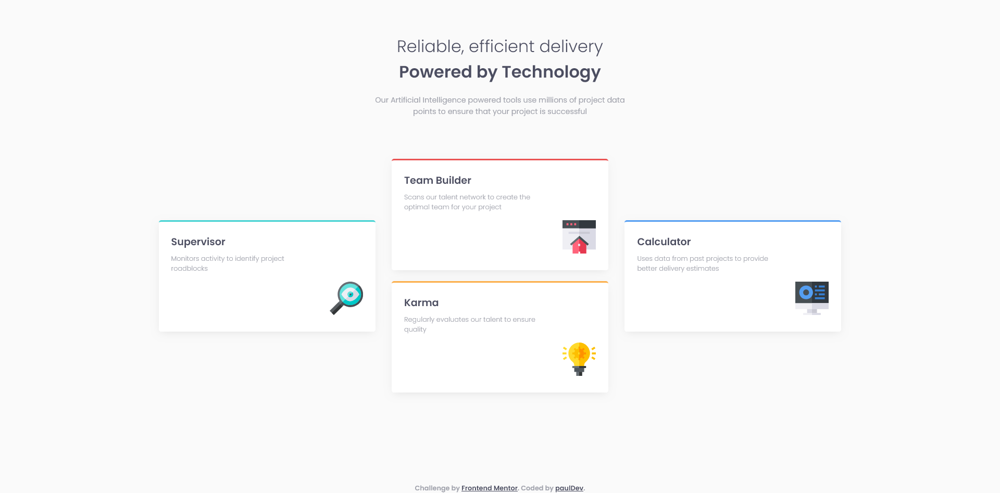

# Frontend Mentor - Four card feature section solution

This is a solution to the [Four card feature section challenge on Frontend Mentor](https://www.frontendmentor.io/challenges/four-card-feature-section-weK1eFYK). Frontend Mentor challenges help you improve your coding skills by building realistic projects. 

## Overview

### The challenge

Your challenge is to build out this feature section and get it looking as close to the design as possible.

Users should be able to:
- View the optimal layout for the site depending on their device's screen size

### My Solution Screenshot

### Links

- Solution URL: [https://www.frontendmentor.io/solutions/frontend-mentor-four-card-feature-section-hAXCG5hW-S](https://www.frontendmentor.io/solutions/frontend-mentor-four-card-feature-section-hAXCG5hW-S)
- Live Site URL: [https://dev-paull.github.io/four-card-feature-section](https://dev-paull.github.io/four-card-feature-section)

## My process

### Built with

- Semantic HTML5 markup
- CSS custom properties
- Flexbox
- CSS Grid
- Mobile-first workflow

### What I learned

Practicing with grids 👍

